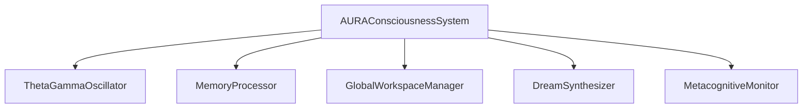
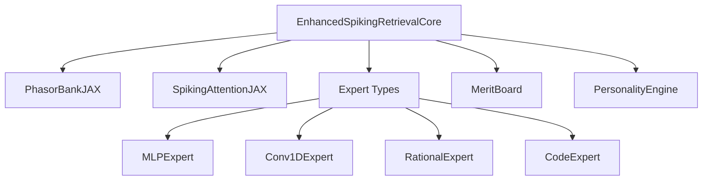
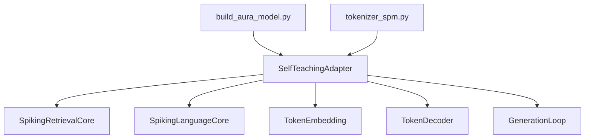
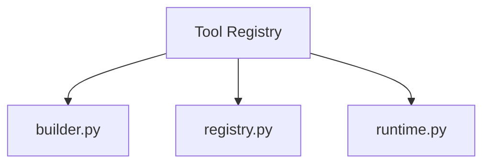
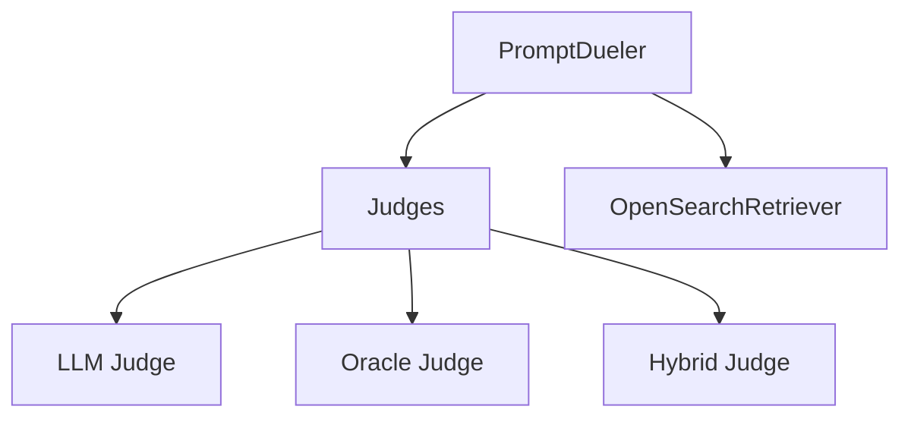
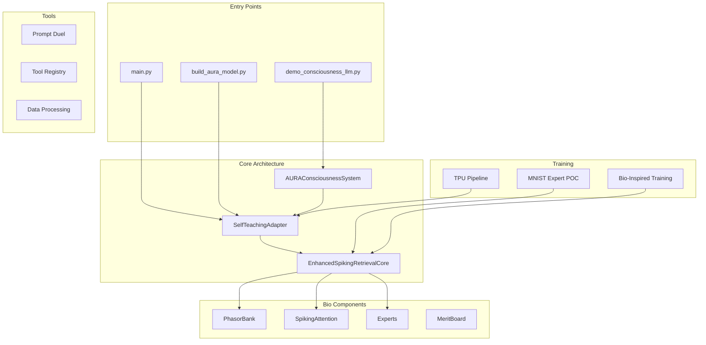

# AURA Codebase Analysis Report

## Overview
Comprehensive analysis of all Python files in `/src/aura/` to identify functionality, dependencies, and usage patterns.

## Core Architecture Modules

### 🧠 Consciousness System (`consciousness/`)

**Files & Status:**
- ✅ `aura_consciousness_system.py` - **ACTIVE** - Main consciousness coordinator
- ✅ `theta_gamma_oscillator.py` - **ACTIVE** - Neural oscillation simulation
- ✅ `memory_processor.py` - **ACTIVE** - Memory consolidation system
- ✅ `global_workspace_manager.py` - **ACTIVE** - Global workspace theory implementation
- ✅ `dream_synthesizer.py` - **ACTIVE** - Dream/creative synthesis
- ✅ `metacognitive_monitor.py` - **ACTIVE** - Self-monitoring system

### 🔬 Bio-Inspired Components (`bio_inspired/`)

**Files & Status:**
- ✅ `enhanced_spiking_retrieval.py` - **ACTIVE** - Core Liquid-MoE with bio-gating
- ✅ `experts.py` - **ACTIVE** - Specialized expert modules (MLP, Conv1D, Rational, Code, SelfImprove)
- ✅ `phasor_bank.py` - **ACTIVE** - Multi-harmonic temporal feature extractor
- ✅ `spiking_attention.py` - **ACTIVE** - k-WTA attention mechanism
- ✅ `merit_board.py` - **ACTIVE** - Expert merit tracking system
- ✅ `personality_engine.py` - **ACTIVE** - Personality-based modulation
- ✅ `personality_jax.py` - **ACTIVE** - JAX personality modulator
- ✅ `expert_registry.py` - **ACTIVE** - Zone-based expert configuration
- ✅ `expert_io.py` - **ACTIVE** - Expert checkpoint I/O utilities
- ✅ `thalamic_router.py` - **ACTIVE** - Thalamic routing/gating system
- ✅ `test_enhanced_retrieval.py` - **ACTIVE** - Unit tests for retrieval core

### 🎯 Self-Teaching LLM (`self_teaching_llm/`)

**Files & Status:**
- ✅ `self_teaching_adapter.py` - **ACTIVE** - Main LLM adapter coordinating all components
- ✅ `spiking_language_core.py` - **ACTIVE** - Core language processing (LIF/SRWKV backends)
- ✅ `spiking_retrieval_core.py` - **ACTIVE** - Retrieval-augmented generation core
- ✅ `token_embedding.py` - **ACTIVE** - Token embedding layer with RoPE support
- ✅ `token_decoder.py` - **ACTIVE** - Token decoding/generation head
- ✅ `generation_loop.py` - **ACTIVE** - Text generation with consciousness integration
- ✅ `tokenizer_spm.py` - **ACTIVE** - SentencePiece tokenizer training/inference
- ✅ `build_aura_model.py` - **ACTIVE** - Main CLI entry point (tokenizer, pretrain, chat)
- ✅ `train_instruct.py` - **ACTIVE** - Instruction tuning pipeline

### 🛠️ Tools & Utilities (`tools/`)

**Files & Status:**
- ✅ `builder.py` - **ACTIVE** - Tool skeleton generator
- ✅ `registry.py` - **ACTIVE** - Tool registration system
- ✅ `runtime.py` - **ACTIVE** - Tool execution runtime

### 🥊 Prompt Duel Optimizer (`prompt_duel/`)

**Files & Status:**
- ✅ `dueler.py` - **ACTIVE** - Double Thompson Sampling prompt optimization
- ✅ `judges.py` - **ACTIVE** - LLM/Oracle/Hybrid judging systems
- ✅ `cli.py` - **ACTIVE** - Command-line interface for prompt dueling

### 📊 Data Processing (`data/`)
**Files & Status:**
- ✅ `hf_stream.py` - **ACTIVE** - Hugging Face dataset streaming utilities
- ✅ `hf_conversations.py` - **ACTIVE** - Conversation format flattening
- ✅ `hf_ultrachat.py` - **ACTIVE** - UltraChat dataset streamer
- ✅ `hf_templategsm.py` - **ACTIVE** - TemplateGSM math dataset streamer

### 🔍 Retrieval (`retrieval/`)
**Files & Status:**
- ✅ `opensearch_ingest.py` - **ACTIVE** - OpenSearch MS MARCO ingestion

### 📥 Ingestion (`ingestion/`)
**Files & Status:**
- ✅ `txt_loader.py` - **ACTIVE** - Text corpus loader with affect vector computation

## Training & Testing Files

### 🏋️ Active Training Pipelines
- ✅ `mnist_expert_poc.py` - **CORE ACTIVE** - Main MNIST expert training with bio-components
- ✅ `bio_inspired_training.py` - **ACTIVE** - Bio-inspired training orchestrator
- ✅ `tpu_training_pipeline.py` - **ACTIVE** - TPU-optimized training pipeline
- ✅ `local_test_pipeline.py` - **ACTIVE** - Local testing pipeline

### 🧪 Test & Validation Files
- ✅ `real_mnist_test.py` - **ACTIVE** - Real MNIST testing with bio-components
- ✅ `mnist_baseline.py` - **ACTIVE** - Baseline MNIST comparison
- ⚠️ `actual_learning_test.py` - **REDUNDANT** - Similar to effective_learning_test.py
- ⚠️ `effective_learning_test.py` - **REDUNDANT** - Similar learning tests
- ⚠️ `extended_learning_test.py` - **REDUNDANT** - Extended version of learning tests
- ⚠️ `simple_learning_test.py` - **REDUNDANT** - Basic learning test
- ⚠️ `sophisticated_learning_test.py` - **REDUNDANT** - Complex learning test
- ⚠️ `mnist_learning_test.py` - **REDUNDANT** - MNIST-specific learning test
- ⚠️ `simple_mnist_test.py` - **REDUNDANT** - Basic MNIST test

### 🔧 Configuration & Setup
- ✅ `cpu_mps_training_config.py` - **ACTIVE** - CPU/MPS training configuration
- ✅ `train_cpu_mps.py` - **ACTIVE** - CPU/MPS training script

### 🗂️ Data Creation
- ✅ `create_minimal_dataset.py` - **ACTIVE** - Minimal dataset creation
- ✅ `create_production_dataset.py` - **ACTIVE** - Production dataset creation

### 🎮 Demo Files
- ✅ `demo_bio_components.py` - **ACTIVE** - Bio-component demonstrations
- ✅ `test_bio_components.py` - **ACTIVE** - Bio-component testing

### 🚨 Potentially Unused Files
- ❓ `simple_phase_test.py` - **MINIMAL** - Simple phase testing (38 lines)
- ❓ `test_all_phases.py` - **MINIMAL** - All phases test (37 lines)

## Root Level Files
- ✅ `demo_consciousness_llm.py` - **ACTIVE** - Consciousness + LLM integration demo
- ✅ `main.py` - **ACTIVE** - Main entry point with multiple subcommands

## Summary

### ✅ CORE ACTIVE (54 files)
All consciousness, bio-inspired, self-teaching LLM, tools, data processing, and main training files are actively used and form the core architecture.

### ⚠️ REDUNDANT (8 files)
Multiple similar learning test files that could be consolidated:
- `actual_learning_test.py`
- `effective_learning_test.py` 
- `extended_learning_test.py`
- `simple_learning_test.py`
- `sophisticated_learning_test.py`
- `mnist_learning_test.py`
- `simple_mnist_test.py`

**Recommendation:** Keep one comprehensive learning test and archive the others.

### ❓ MINIMAL (2 files)
Very small test files that may be experimental:
- `simple_phase_test.py` (38 lines)
- `test_all_phases.py` (37 lines)

**Recommendation:** Review if these provide unique value or can be merged.

## Architecture Flow

## Conclusion
The codebase is well-structured with clear separation of concerns. The core architecture is actively used, but there are several redundant test files that could be consolidated to reduce maintenance overhead.
