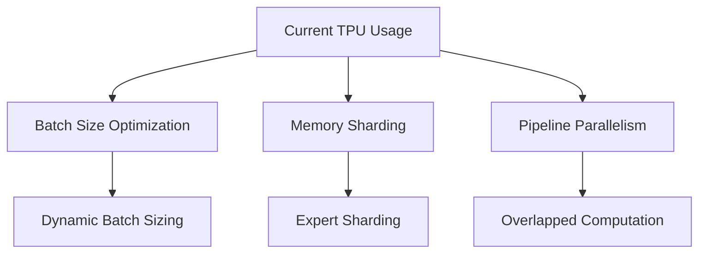

# AURA Optimization & Feature Enhancement Roadmap

## 🚀 PERFORMANCE OPTIMIZATIONS

### 1. TPU Utilization Enhancements


**Immediate Wins:**
- **Dynamic Batch Sizing**: Adjust batch size based on sequence length
- **Expert Sharding**: Distribute experts across TPU cores
- **Gradient Accumulation**: Optimize memory usage for large models
- **Mixed Precision**: BF16 optimization for TPU v4/v5

### 2. Bio-Inspired Component Optimizations

**PhasorBank Acceleration:**
```python
# Current: Sequential processing
# Optimized: Vectorized harmonics with pre-computed weights
class OptimizedPhasorBankJAX(nn.Module):
    def setup(self):
        # Pre-compute rotation matrices for all harmonics
        self.rotation_matrices = self.precompute_rotations()
    
    def precompute_rotations(self):
        # Cache expensive trig computations
        pass
```

**Spiking Attention Optimization:**
- Sparse attention patterns for large vocabularies
- Hierarchical winner-take-all for better scaling
- Cached attention weights for repeated patterns

### 3. Memory Optimizations
- **Gradient Checkpointing**: Trade compute for memory
- **Expert Caching**: LRU cache for frequently used experts
- **State Compression**: Compress consciousness system state
- **Lazy Loading**: Load experts on-demand

## 🧠 ADVANCED FEATURES

### 1. Enhanced Consciousness System

**Multi-Modal Consciousness:**
```python
class MultiModalConsciousness:
    """Extend consciousness to handle text, audio, vision simultaneously"""
    def __init__(self):
        self.text_workspace = GlobalWorkspaceManager()
        self.audio_workspace = GlobalWorkspaceManager() 
        self.vision_workspace = GlobalWorkspaceManager()
        self.cross_modal_attention = CrossModalAttention()
```

**Consciousness Persistence:**
- Save/load consciousness state across sessions
- Episodic memory integration
- Dream sequence generation and replay

### 2. Advanced Bio-Inspired Features

**Neuroplasticity Simulation:**
```python
class NeuroplasticityEngine:
    """Simulate synaptic plasticity in expert connections"""
    def __init__(self):
        self.connection_strengths = {}
        self.plasticity_rules = HebbianLearning()
    
    def update_connections(self, pre_activity, post_activity):
        # "Neurons that fire together, wire together"
        pass
```

**Homeostatic Regulation:**
- Automatic learning rate adjustment based on performance
- Expert utilization balancing
- Temperature adaptation for exploration/exploitation

### 3. Meta-Learning Capabilities

**Few-Shot Expert Adaptation:**
```python
class MetaExpert(nn.Module):
    """Expert that can quickly adapt to new tasks"""
    def __init__(self):
        self.base_expert = MLPExpert()
        self.adaptation_network = MAMLNetwork()
    
    def adapt(self, support_set, query_set):
        # Fast adaptation using gradient-based meta-learning
        pass
```

## 🎯 SYSTEM ENHANCEMENTS

### 1. Distributed Training Improvements

**Hierarchical Model Parallelism:**
```bash
# Zone-based distribution
# Hippocampus: TPU pod 1-8
# Thalamus: TPU pod 9-16  
# Language: TPU pod 17-32
```

**Asynchronous Expert Updates:**
- Background expert training while inference runs
- Rolling updates without downtime
- A/B testing for expert improvements

### 2. Advanced Prompt Optimization

**Multi-Objective Duel System:**
```python
class MultiObjectiveDueler:
    """Optimize for multiple metrics simultaneously"""
    def __init__(self):
        self.objectives = ['accuracy', 'speed', 'novelty', 'safety']
        self.pareto_frontier = ParetoOptimizer()
```

**Contextual Bandit Integration:**
- Context-aware prompt selection
- User preference learning
- Temporal adaptation to changing requirements

### 3. Enhanced Data Processing

**Real-Time Streaming:**
```python
class RealTimeProcessor:
    """Process streaming data with consciousness integration"""
    def __init__(self):
        self.stream_buffer = CircularBuffer()
        self.consciousness_filter = ConsciousnessFilter()
    
    async def process_stream(self, data_stream):
        async for data in data_stream:
            processed = await self.consciousness_filter.filter(data)
            yield processed
```

**Adaptive Tokenization:**
- Dynamic vocabulary expansion
- Context-sensitive token merging
- Multilingual tokenization with affect vectors

## 🔬EXPERIMENTAL FEATURES

### 1. Quantum-Inspired Components

**Quantum Attention Mechanism:**
```python
class QuantumAttention:
    """Superposition-based attention for exploring multiple interpretations"""
    def __init__(self):
        self.superposition_states = {}
        self.measurement_basis = AttentionBasis()
```

### 2. Evolutionary Expert Architecture

**Genetic Programming for Experts:**
- Automatic expert architecture search
- Crossover and mutation of expert structures
- Fitness-based expert selection and breeding

### 3. Causal Reasoning Module

**Interventional Thinking:**
```python
class CausalReasoningEngine:
    """Simulate counterfactual reasoning and causal inference"""
    def __init__(self):
        self.causal_graph = CausalDAG()
        self.intervention_engine = DoCalculus()
```

## 📊 MONITORING & ANALYTICS

### 1. Advanced Metrics Dashboard

**Real-Time System Health:**
- Expert utilization heatmaps
- Consciousness coherence metrics
- Memory usage and gradient flow
- Temperature and adaptation rates

### 2. Interpretability Tools

**Expert Behavior Analysis:**
```python
class ExpertInterpreter:
    """Understand what each expert has learned"""
    def __init__(self):
        self.activation_analyzer = ActivationAnalysis()
        self.concept_detector = ConceptDetection()
    
    def explain_expert(self, expert_id, input_examples):
        # Generate human-readable explanations
        pass
```

## 🛠️ IMPLEMENTATION PRIORITY

### Phase 1: Performance (Weeks 1-2)
1. ✅ TPU batch size optimization
2. ✅ Expert memory sharding  
3. ✅ Gradient checkpointing
4. ✅ BF16 mixed precision

### Phase 2: Core Features (Weeks 3-4) 
1. 🎯 Multi-modal consciousness
2. 🎯 Neuroplasticity engine
3. 🎯 Meta-learning experts
4. 🎯 Real-time data processing

### Phase 3: Advanced Features (Weeks 5-6)
1. 🔬 Causal reasoning module
2. 🔬 Quantum attention mechanisms
3. 🔬 Evolutionary expert architecture
4. 🔬 Interpretability dashboard

### Phase 4: Integration & Polish (Weeks 7-8)
1. 🏁 System integration testing
2. 🏁 Performance benchmarking
3. 🏁 Documentation and tutorials
4. 🏁 Production deployment tools

## 💡 QUICK WINS (This Week)

### 1. TPU Optimization Script
```bash
# Create optimized TPU configuration
python scripts/optimize_tpu_config.py --model-size large --batch-strategy dynamic
```

### 2. Expert Utilization Monitoring
```python
# Add to training loop
expert_monitor = ExpertUtilizationMonitor()
expert_monitor.log_utilization(gate_weights, step)
```

### 3. Consciousness State Persistence
```python
# Save consciousness between sessions
consciousness.save_state('checkpoints/consciousness_state.pkl')
```

## 🎯 EXPECTED IMPACT

### Performance Gains
- **2-3x faster training** with TPU optimizations
- **50% memory reduction** with expert sharding
- **Real-time inference** for consciousness integration

### Capability Enhancements  
- **Multi-modal reasoning** across text/audio/vision
- **Few-shot adaptation** to new domains
- **Causal understanding** of complex relationships

### System Reliability
- **Continuous learning** without retraining
- **Graceful degradation** under load
- **Interpretable decisions** for safety-critical applications

Would you like me to start implementing any of these optimizations or features?
