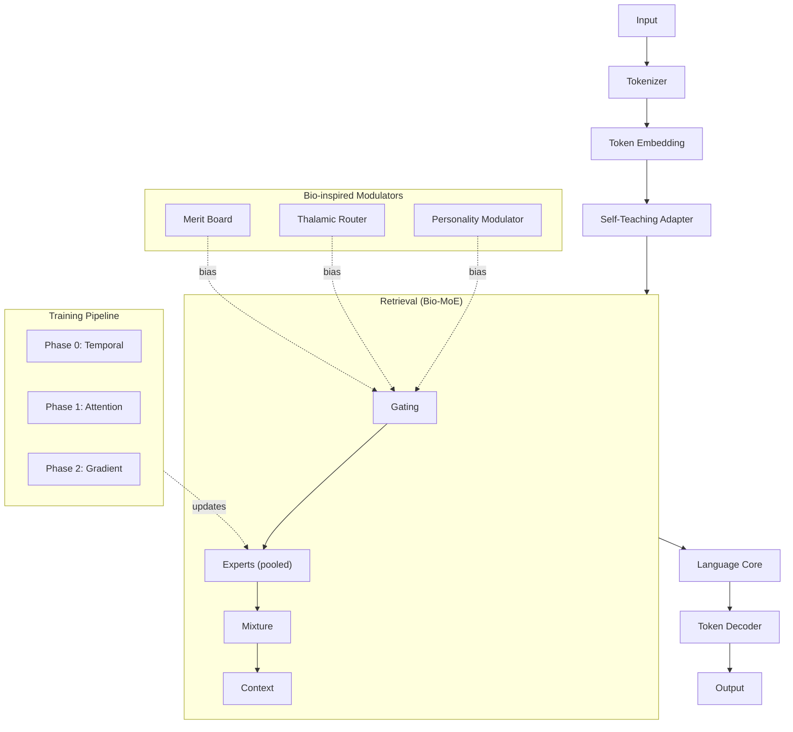

```mermaid
flowchart TD
  IN["Input"] --> TKN["Tokenizer"]
  TKN --> EMB["Token Embedding"]
  EMB --> ADP["Self-Teaching Adapter"]

  subgraph RETRIEVAL["Retrieval (Bio‑MoE)"]
    direction TB
    GATE["Gating"] --> EXP["Experts (pooled)"]
    EXP --> MIX["Mixture"]
    MIX --> CTX["Context"]
  end

  ADP --> RETRIEVAL
  RETRIEVAL --> SLC["Language Core"]
  SLC --> DEC["Token Decoder"]
  DEC --> OUT["Output"]

  subgraph MODS["Bio‑inspired Modulators"]
    MB["Merit Board"]
    TR["Thalamic Router"]
    PM["Personality Modulator"]
  end

  MB -. bias .-> GATE
  TR -. bias .-> GATE
  PM -. bias .-> GATE

  subgraph TRAIN["Training Pipeline"]
    P0["Phase 0: Temporal"]
    P1["Phase 1: Attention"]
    P2["Phase 2: Gradient"]
  end

  TRAIN -. updates .-> EXP
```
